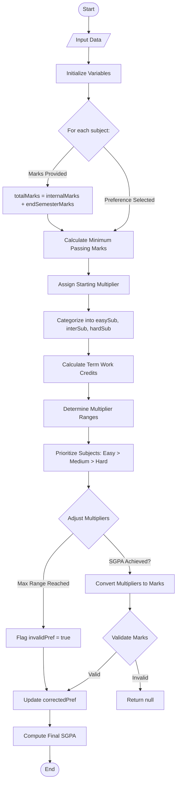

# AceGrade - SGPA Prediction App

🚀 **AceGrade** is an Android app designed for Mumbai University students to help them predict and achieve their desired SGPA efficiently. The app utilizes a custom algorithm to generate the minimum marks combination required based on user preferences, ensuring students have a clear understanding of their academic goals.

## ⭐ Key Features

1. **Target Marks Prediction** - Calculates the marks required in each subject to achieve the desired SGPA.
2. **SGPA Prediction** - Estimates SGPA based on expected or achieved marks.
3. **Marks Combination Handling** - Provides clear explanations and proper representation for each case, ensuring accuracy and transparency.

## 📱 Technology Stack

- **Frontend:** XML (UI/UX design), custom components (EditText, Buttons, Dropdowns, CardView, RecyclerView for structured design).
- **Backend:** Java (Prediction algorithm, data handling, interactive effects, animations, haptic feedback for errors).
- **Database & Analytics:** Firebase (Bug tracking, user input data analysis for reliability and accuracy).

## 🔗 Download the App

[Download AceGrade APK (v1.0.1-beta.1)](https://www.mediafire.com/file/uoq0g3tlgrdghjv/AceGrade_1.0.1-beta.1-android.apk/file)

---

# 📖 SGPA Prediction Algorithm

## Step 1: Input Data
### User Inputs:
- **Subject Preferences:** Easy (0), Medium (1), or Hard (2) for incomplete subjects.
- **Actual Marks:** End-semester marks for completed subjects (if any).
- **Term Work Marks:** Marks scored in term work for each subject.
- **Internal Marks:** Marks from unit tests.
- **Desired SGPA:** Target SGPA the user wants to achieve.

## Step 2: Initialize Variables
### For each subject:
#### If Marks Are Provided:
Calculate total marks:
```java
totalMarks = internalMarks + endSemesterMarks;
```
#### If Preference Is Selected:
Calculate minimum passing marks based on the subject’s range:

| Range | Passing Marks Formula |
|-------|-----------------------|
| 80    | internalMarks + 32    |
| 60    | internalMarks + 24    |
| 45    | internalMarks + 18    |

Assign a starting multiplier based on the subject’s range and calculated passing marks.

Example: For an 80-range subject, use:
```java
Range.sub.getMultiplierFor100(interPlusPass);
```
Categorize Subjects:
- Group subjects into `easySub`, `interSub`, or `hardSub` lists based on preferences.

## Step 3: Calculate Term Work Credits
Sum term work credits using the function and iterative loop over the number of subjects:
```java
termWorkSum += Range.sub.subTwGetCredit(termWorkMarks, termWorkCredit);
```

## Step 4: Determine Multiplier Ranges
### Start Range:
The iteration count at which multiplier incrementation begins for a subject depends on preference combinations:

| Combination         | Easy | Medium | Hard |
|---------------------|------|--------|------|
| Easy + Medium + Hard | 0    | 2      | 3    |
| Easy + Medium      | 0    | 2      | -    |
| Medium + Hard      | -    | 0      | 2    |

### End Range:
The maximum allowed multiplier for a subject:

| Preference | End Range Formula |
|------------|------------------|
| Easy       | 10               |
| Medium     | startMul + 2 (if 5/6) else startMul + 3 |
| Hard       | startMul + 1 (if 5/6) else startMul + 2 |

## Step 5: Adjust Multipliers to Achieve SGPA
### Prioritize Subjects:
Order of adjustment:
1. Easy → Medium → Hard subjects.
2. 2-credit subjects within each category.

### Increment Multipliers:
For each prioritized subject:
- Increment its multiplier until:
  - The calculated SGPA ≥ desired SGPA (`sgpaTC`).
  - The multiplier reaches its `endRange`.
- Exit loop if all subjects hit their `endRange` and SGPA is still unmet (flag `invalidPref`).

## Step 6: Validate & Calculate Final Marks
### Convert Multipliers to Marks:
Use subject range-specific methods:
```java
// For 80-range subjects:
marks = Range.sub.getMarksFor100(multiplier, interPlusPass) - internalMarks;
```
### Validation:
- Ensure `marks ≤ subject’s maximum range` (e.g., ≤80 for 80-range subjects).
- If marks exceed range, return `null` (invalid case), else return the final set of marks for each subject.

### Update Preferences:
- Adjust `correctedPref` if multipliers exceed preference limits (e.g., Easy → Medium).

## Step 7: Compute Final SGPA
- If actual marks were provided, directly compute SGPA by calling the `calculateSgpa` function.
```java
preTC = calculateSgpa(termWorkMrks, internalMrks, endSemMrks);
```
- Otherwise, calculate total credits and store it into preTC:
```java
preTC = subCreditSum(sub) + sum;
```
### SGPA Formula:
- Round SGPA upto 2 decimal places.
```java
preTC = Math.round((preTC / Credits)*100)/100f; 
```
## Definitions
## Multiplier :
- A multiplier is the number used to calculate total credit scored per subject.
- Example: If a subject has **3 credits** and the **desired SGPA is 8**, the multiplier will be adjusted based on the subject preference. If it's an **easy** subject, the multiplier will likely range **between 6 and 10**. If determined as **9**, the total credit for that subject would be : `3 * 9 = 27`


---

## 📊 Flowchart

For a visual representation of the workflow, see the flowchart below:



---

## 💬 Feedback

Your feedback is valuable! Please download the app and share your thoughts to help improve the experience.

📧 Contact: [ronaks21205@gmail.com]

---
